# rdditbbs

A terminal Reddit reader that looks and feels like a 1990s bulletin board
system: hotkey menus, a command prompt, numbered messages, a threaded
comment index with a peek pane, and a one-message reader. Read-only.

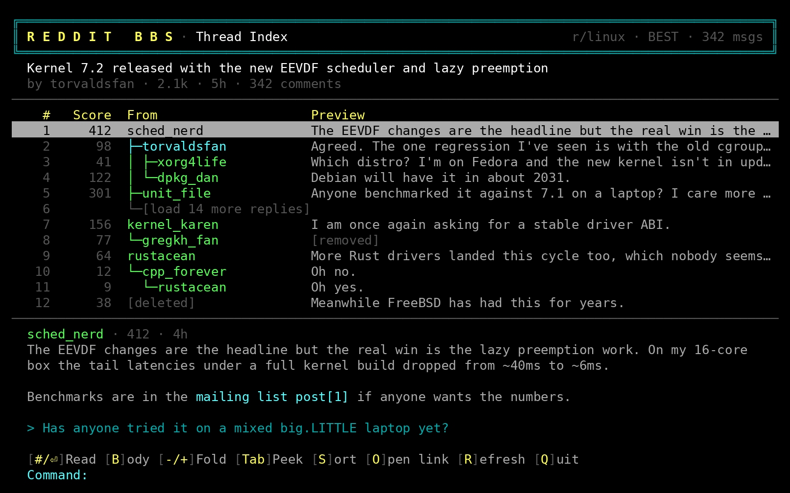

## Screens

| | |
| --- | --- |
| 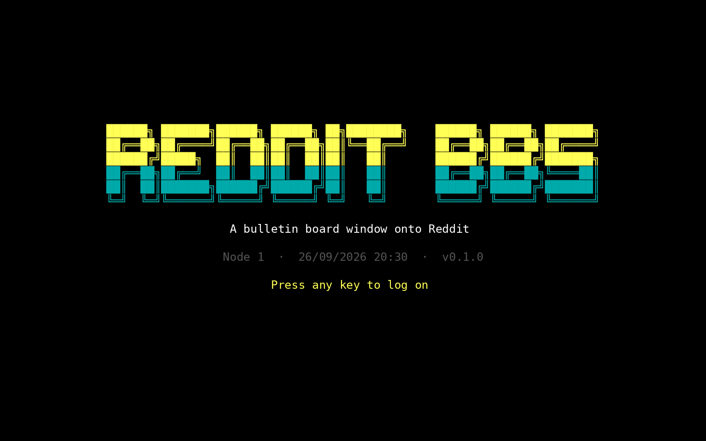 | 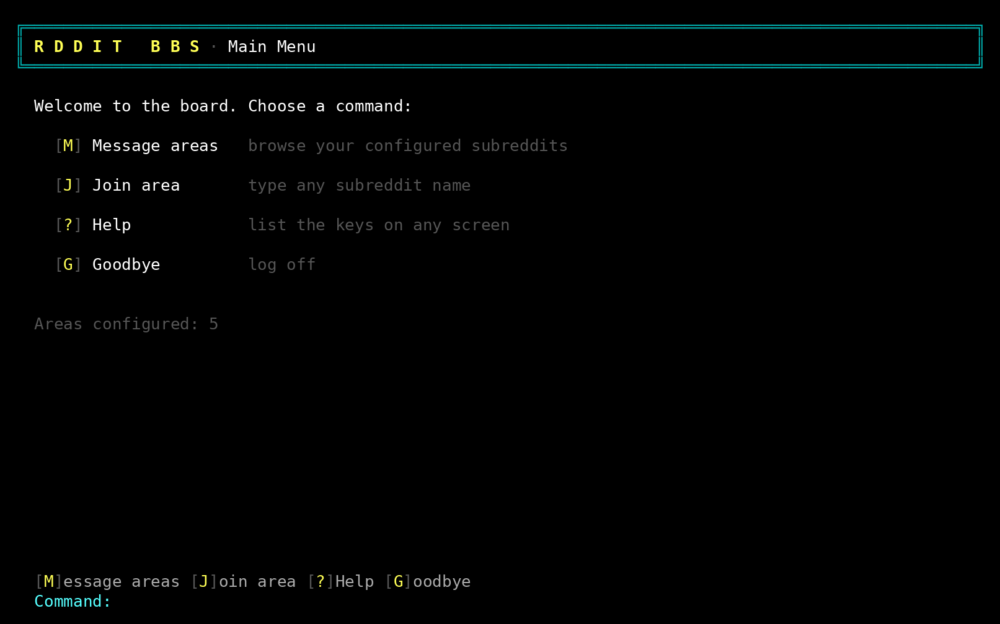 |
| 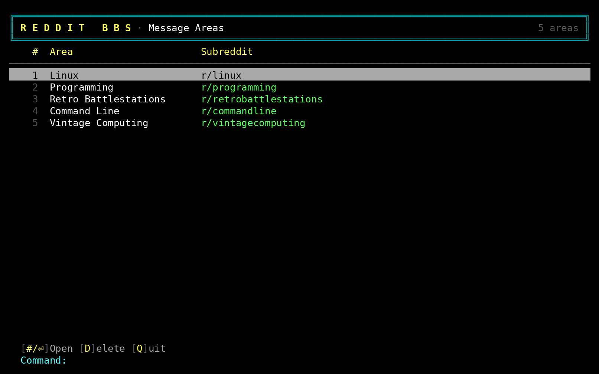 | 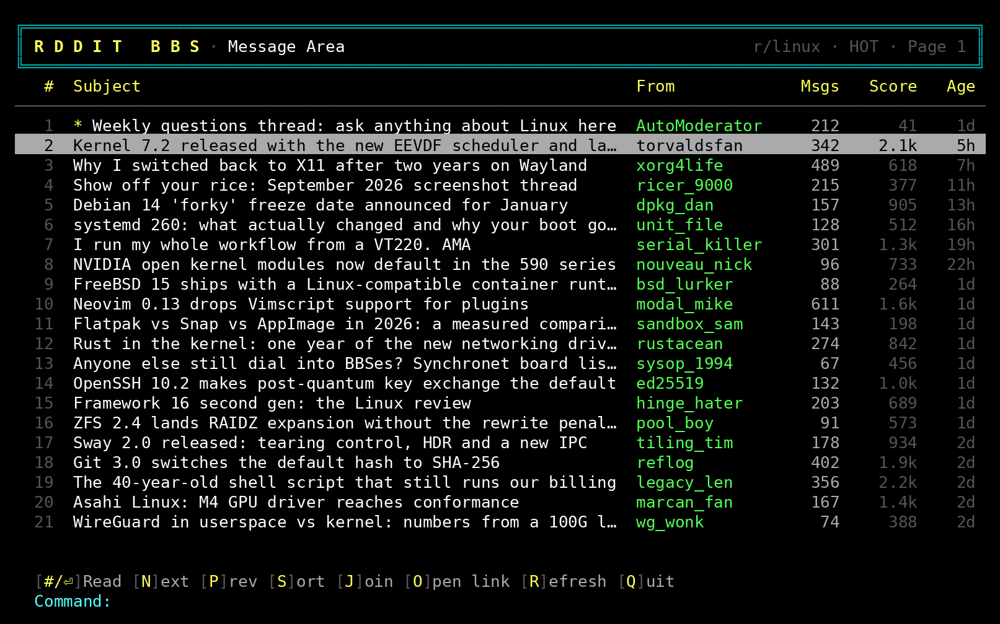 |
| 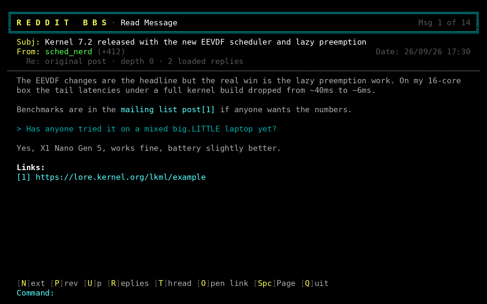 | 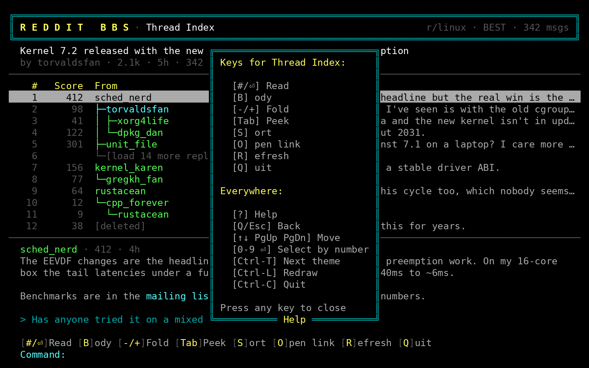 |
| 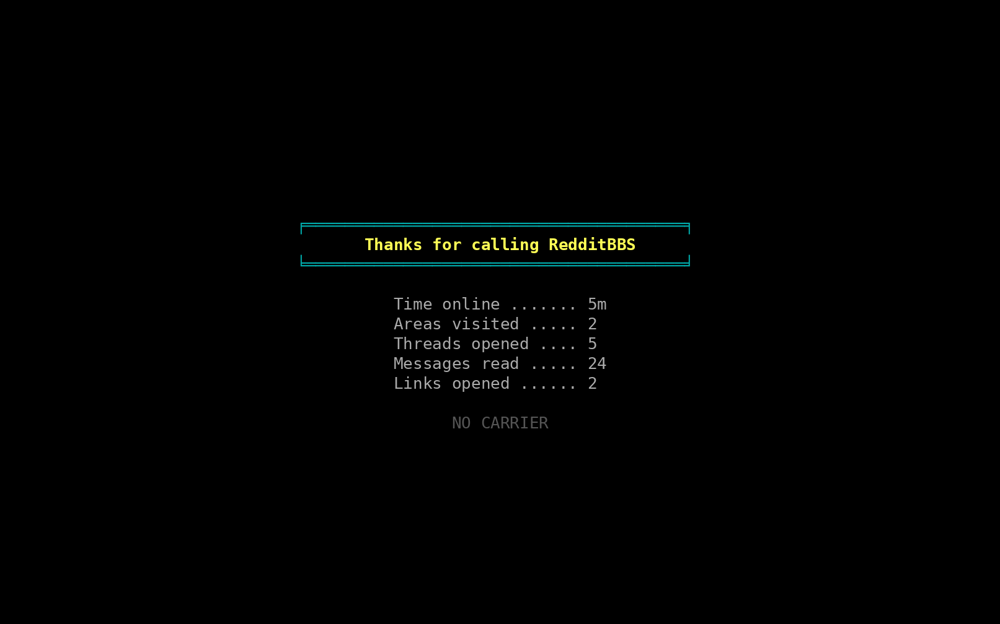 | |

The screenshots are captured from the program itself on a 100 by 30
simulated terminal with sample data; `make screenshots` regenerates them.

## Themes

Four themes are built in, all within the 16 ANSI colours so they work in
any terminal and follow your terminal's own palette. `Ctrl-T` cycles them
on any screen (except while you are typing into a field) and remembers the
choice.

| `classic` | `blue` |
| --- | --- |
|  | 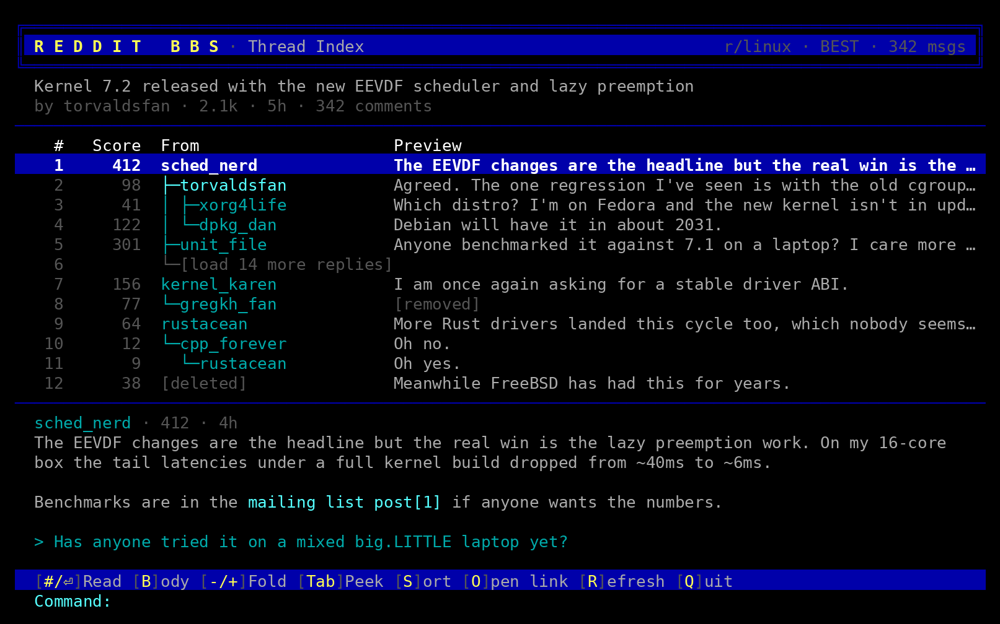 |

| `amber` | `green` |
| --- | --- |
| 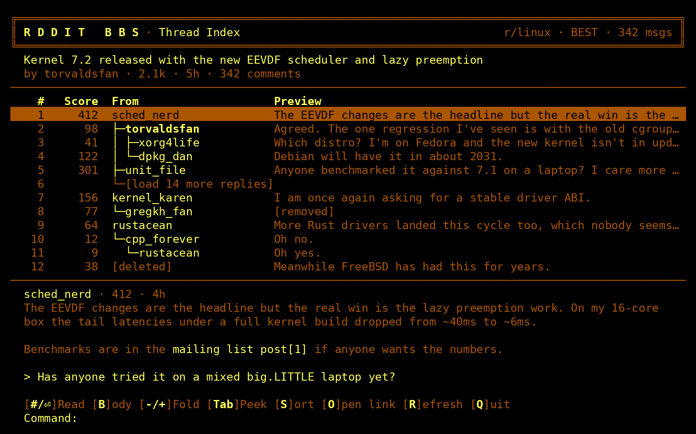 | 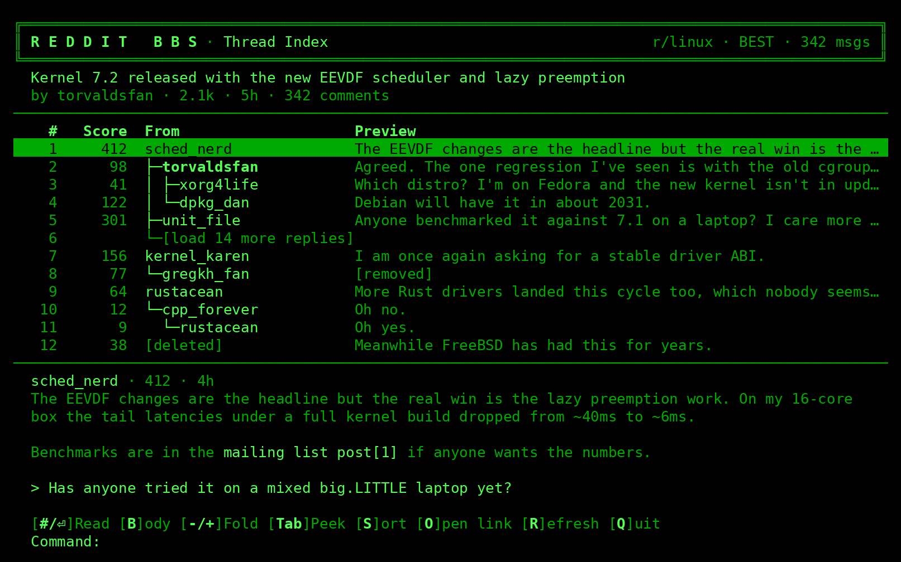 |

Pick one in the config, or define your own by overriding roles on top of a
base theme. Each value is `<colour> [on <colour>] [bold] [reverse]` using
the ANSI names (`black`, `red`, `green`, `yellow`, `blue`, `magenta`,
`cyan`, `white`, their `bright` variants, `grey`, or `default`):

```toml
[display]
theme = "custom"

[theme]
base = "classic"
heading = "bright red"
cursor = "black on cyan"
author = "green bold"
```

Roles: `frame`, `logo`, `heading`, `subject`, `author`, `op`, `mod`, `meta`,
`body`, `quote`, `code`, `bold`, `link`, `prompt`, `hotkey`, `error`,
`stub`, `rule`, `cursor`, `sticky`, `nsfw`, `bar` (the fill behind the
title and hotkey bars). A mistake in the table is reported at startup with
the key that caused it.

## Status

This is a personal-use project. Reddit's Data API requires per-account
approval under its Responsible Builder Policy, and access has been requested
for the author's own account only. The source is published so that request
can be reviewed; the repository contains no credentials and the program is
not offered as a general Reddit client. If you build it yourself, the only
modes that work without Reddit's approval are `--demo`, which browses
built-in sample data, and RSS mode (see below).

## Building

`make build` (needs Go 1.27) produces a static binary at `bin/rdditbbs`.
`./bin/rdditbbs --demo` runs the whole interface against sample data.

With approved credentials, the first run shows a setup screen that checks
them against Reddit and saves them to `~/.config/rdditbbs/config.toml`
with mode 0600. `RDDITBBS_CLIENT_ID` and `RDDITBBS_CLIENT_SECRET` override
the file and are never written to disk. `--config PATH` uses another file.
`--debug` saves the last unparseable API response to
`~/.local/state/rdditbbs/last-error.json`.

## RSS mode

Without approved credentials the program falls back to Reddit's public Atom
feeds, which need no registration. `--rss` forces it; `[reddit] source =
"api"` or `"rss"` in the config pins it (the default `auto` uses the API
when credentials exist). The title bar shows `RSS` so the mode is never in
doubt. What changes:

- No scores or comment counts; those columns show `–`.
- Comments arrive flat, in feed order, with no threading, folding or
  "load more". Sorting comments is not available.
- Reddit allows roughly one feed request a minute per address. Listings
  are cached for 10 minutes and threads for 15, and while you read one
  thread the next post's thread is prefetched if the allowance permits,
  so browsing in order feels quicker than jumping about. When you do have
  to wait, the status line shows the countdown.

## Keys

Everywhere: `?` help, `Q` or `Esc` back, arrows and PgUp/PgDn move the
cursor, type a number and `Enter` to select a row, `Ctrl-T` next theme,
`Ctrl-L` redraw, `Ctrl-C` quit.

| Screen | Keys |
| --- | --- |
| Main Menu | `M` message areas, `J` join any subreddit, `G` goodbye |
| Area List | `Enter` open, `D` delete |
| Post List | `Enter` read, `N`/`P` page, `S` sort, `J` join, `A` add area, `O` open link, `R` refresh |
| Thread Index | `Enter` read, `B` post body, `-`/`+` fold, `Tab` peek pane, `Space` scroll peek, `S` sort, `O` open link, `R` refresh |
| Message Reader | `N`/`P` next/previous, `U` parent, `R` replies, `T` back to index, `O` open link, `Space` page |

## Configuration


## Licence

MIT. See `LICENSE`.
